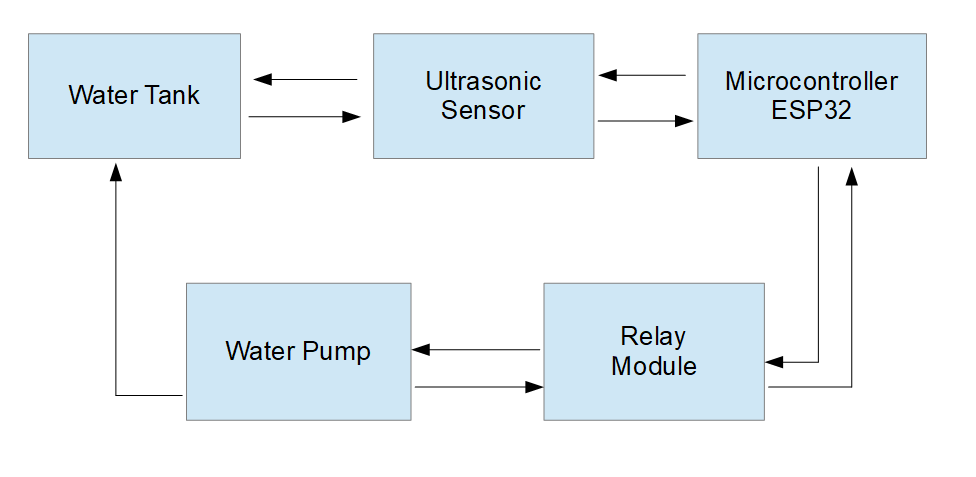

# Smart Home Water Motor

## Overview

This project presents a smart home water motor control system designed to optimize water usage and energy efficiency. The system uses an ultrasonic sensor to monitor the water level in an overhead tank and a relay module to control the water motor. The integration of these components with a microcontroller enables intelligent decision-making based on real-time water level data.

## Table of Contents

- [Introduction](#introduction)
- [Motivation](#motivation)
- [Features](#features)
- [System Design](#system-design)
- [Components](#components)
- [Setup and Installation](#setup-and-installation)
- [Usage](#usage)
- [Future Enhancements](#future-enhancements)
- [Contributors](#contributors)

## Introduction

Traditional water motors often operate on predetermined schedules or require manual switching, leading to wastage of water and energy. This project aims to provide an automated and intelligent solution to optimize water motor operation based on real-time water level data.

## Motivation

The motivation behind this project includes:
- Addressing water scarcity by promoting responsible and optimized water usage.
- Improving energy efficiency by avoiding unnecessary pump operation.
- Providing a user-friendly and automated solution for managing household water resources.

## Features

- Automated motor control based on water level.
- Reduced energy consumption.
- Easy integration with existing smart home infrastructure.
- Remote monitoring and control capabilities.
- Potential for future enhancements such as leak detection and water usage analytics.

## System Design

### Block Diagram

### Circuit Diagram

### Design Procedure

1. **Component Selection**: Choose appropriate components like ultrasonic sensor, relay module, and microcontroller (e.g., Arduino).
2. **System Integration**: Connect the components ensuring proper wiring and signal transmission.
3. **Algorithm Development**: Implement an algorithm for the microcontroller to process sensor data and control the relay.

## Components

- Ultrasonic Sensor
- Relay Module
- Microcontroller (e.g., ESP32)
- Power Supply
- Connecting Wires

## Setup and Installation

1. Follow the circuit diagram to connect the components.
2. Upload the provided Arduino code to your microcontroller.

## Usage

1. Ensure all components are properly connected.
2. Power the system.
3. The microcontroller will automatically control the water motor based on the water level.

## Future Enhancements

- Integration with existing smart home systems.
- Adding features like leak detection and water usage analytics.
- Remote monitoring and control through a web interface or mobile app.

## Contributors

- **Sasanka Barman** (Roll No: 210101016)
- **Himangki Das** (Roll No: 210101024)
